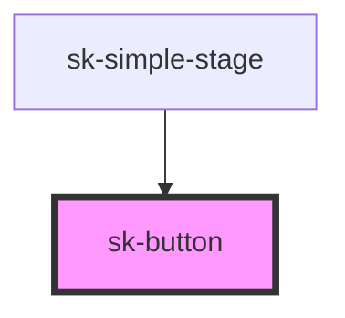

# sk-button

<!-- Auto Generated Below -->

## Properties

| Property   | Attribute  | Description | Type                              | Default    |
| ---------- | ---------- | ----------- | --------------------------------- | ---------- |
| `disabled` | `disabled` |             | `boolean`                         | `false`    |
| `label`    | `label`    |             | `string`                          | `'Button'` |
| `size`     | `size`     |             | `"l" \| "m" \| "s"`               | `'m'`      |
| `type`     | `type`     |             | `"button" \| "reset" \| "submit"` | `'button'` |

## Dependencies

### Used by

 - [sk-simple-stage](../simple-stage)

### Graph

----------------------------------------------

*Built with [StencilJS](https://stenciljs.com/)*
