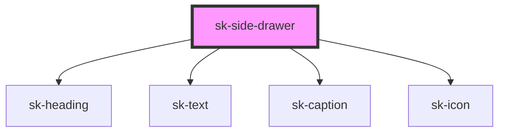

# sk-side-drawer

<!-- Auto Generated Below -->

## Properties

| Property | Attribute | Description | Type      | Default     |
| -------- | --------- | ----------- | --------- | ----------- |
| `header` | `header`  |             | `string`  | `undefined` |
| `open`   | `open`    |             | `boolean` | `undefined` |

## Dependencies

### Depends on

- [sk-heading](../sk-heading)
- [sk-text](../sk-text)
- [sk-caption](../sk-caption)
- [sk-icon](../sk-icon)

### Graph

----------------------------------------------

*Built with [StencilJS](https://stenciljs.com/)*
