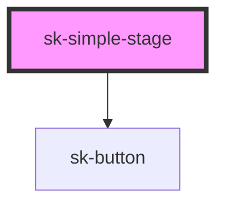

# sk-simple-stage

<!-- Auto Generated Below -->

## Properties

| Property      | Attribute     | Description | Type                 | Default                                            |
| ------------- | ------------- | ----------- | -------------------- | -------------------------------------------------- |
| `ctaLabel`    | `cta-label`   |             | `string`             | `'Learn more'`                                     |
| `description` | `description` |             | `string`             | `'Simple stage description for a teaser section.'` |
| `heading`     | `heading`     |             | `string`             | `'Simple Stage Title'`                             |
| `maxHeight`   | `max-height`  |             | `string`             | `'78vh'`                                           |
| `mediaAlt`    | `media-alt`   |             | `string`             | `'Stage teaser media'`                             |
| `mediaSrc`    | `media-src`   |             | `string`             | `undefined`                                        |
| `mediaType`   | `media-type`  |             | `"image" \| "video"` | `'image'`                                          |
| `minHeight`   | `min-height`  |             | `string`             | `'55vh'`                                           |
| `poster`      | `poster`      |             | `string`             | `undefined`                                        |

## Dependencies

### Depends on

- [sk-button](../button)

### Graph

----------------------------------------------

*Built with [StencilJS](https://stenciljs.com/)*
