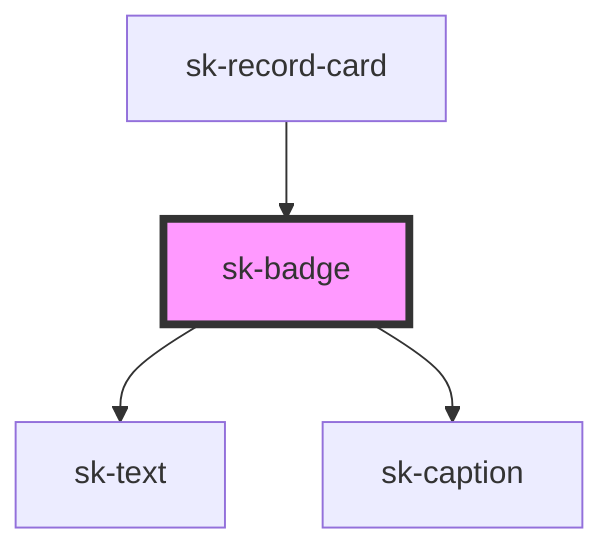

# sk-badge

<!-- Auto Generated Below -->

## Properties

| Property  | Attribute | Description | Type                                                                        | Default     |
| --------- | --------- | ----------- | --------------------------------------------------------------------------- | ----------- |
| `color`   | `color`   |             | `"accent" \| "default" \| "error" \| "secondary" \| "success" \| "warning"` | `'default'` |
| `label`   | `label`   |             | `string`                                                                    | `''`        |
| `variant` | `variant` |             | `"ai-chip" \| "category" \| "filled" \| "status"`                           | `'status'`  |

## Events

| Event     | Description | Type                      |
| --------- | ----------- | ------------------------- |
| `skClick` |             | `CustomEvent<MouseEvent>` |

## Dependencies

### Used by

 - [sk-record-card](../../patterns/sk-record-card)

### Depends on

- [sk-text](../sk-text)
- [sk-caption](../sk-caption)

### Graph

----------------------------------------------

*Built with [StencilJS](https://stenciljs.com/)*
