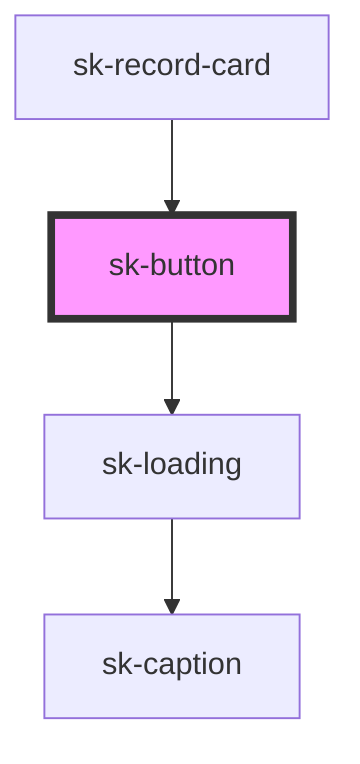

# sk-button

<!-- Auto Generated Below -->

## Properties

| Property          | Attribute    | Description | Type                                                   | Default     |
| ----------------- | ------------ | ----------- | ------------------------------------------------------ | ----------- |
| `accessibleLabel` | `aria-label` |             | `string`                                               | `undefined` |
| `disabled`        | `disabled`   |             | `boolean`                                              | `false`     |
| `fullWidth`       | `full-width` |             | `boolean`                                              | `false`     |
| `iconOnly`        | `icon-only`  |             | `boolean`                                              | `false`     |
| `loading`         | `loading`    |             | `boolean`                                              | `false`     |
| `size`            | `size`       |             | `"lg" \| "md" \| "sm"`                                 | `'md'`      |
| `type`            | `type`       |             | `"button" \| "reset" \| "submit"`                      | `'button'`  |
| `variant`         | `variant`    |             | `"destructive" \| "ghost" \| "primary" \| "secondary"` | `'primary'` |

## Dependencies

### Used by

 - [sk-record-card](../../patterns/sk-record-card)

### Depends on

- [sk-loading](../sk-loading)

### Graph

----------------------------------------------

*Built with [StencilJS](https://stenciljs.com/)*
