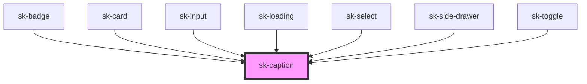

# sk-caption

<!-- Auto Generated Below -->

## Properties

| Property | Attribute | Description | Type                 | Default  |
| -------- | --------- | ----------- | -------------------- | -------- |
| `align`  | `align`   |             | `"center" \| "left"` | `'left'` |

## Dependencies

### Used by

 - [sk-badge](../sk-badge)
 - [sk-card](../sk-card)
 - [sk-input](../sk-input)
 - [sk-loading](../sk-loading)
 - [sk-select](../sk-select)
 - [sk-side-drawer](../side-drawer)
 - [sk-toggle](../sk-toggle)

### Graph

----------------------------------------------

*Built with [StencilJS](https://stenciljs.com/)*
