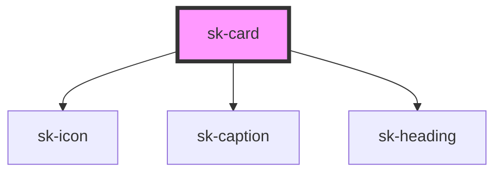

# sk-card

<!-- Auto Generated Below -->

## Properties

| Property          | Attribute    | Description | Type                                 | Default     |
| ----------------- | ------------ | ----------- | ------------------------------------ | ----------- |
| `accessibleLabel` | `aria-label` |             | `string`                             | `undefined` |
| `cardTitle`       | `title`      |             | `string`                             | `''`        |
| `imageAlt`        | `image-alt`  |             | `string`                             | `''`        |
| `imageSrc`        | `image-src`  |             | `string`                             | `''`        |
| `selected`        | `selected`   |             | `boolean`                            | `false`     |
| `subtitle`        | `subtitle`   |             | `string`                             | `''`        |
| `variant`         | `variant`    |             | `"default" \| "image" \| "selected"` | `'default'` |

## Events

| Event     | Description | Type                                       |
| --------- | ----------- | ------------------------------------------ |
| `skClick` |             | `CustomEvent<KeyboardEvent \| MouseEvent>` |

## Dependencies

### Depends on

- [sk-icon](../sk-icon)
- [sk-caption](../sk-caption)
- [sk-heading](../sk-heading)

### Graph

----------------------------------------------

*Built with [StencilJS](https://stenciljs.com/)*
