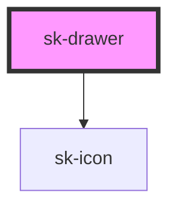

# sk-drawer

<!-- Auto Generated Below -->

## Properties

| Property          | Attribute    | Description | Type                                                         | Default       |
| ----------------- | ------------ | ----------- | ------------------------------------------------------------ | ------------- |
| `accessibleLabel` | `aria-label` |             | `string`                                                     | `undefined`   |
| `drawerTitle`     | `title`      |             | `string`                                                     | `''`          |
| `isMobile`        | `is-mobile`  |             | `boolean`                                                    | `false`       |
| `open`            | `open`       |             | `boolean`                                                    | `false`       |
| `type`            | `type`       |             | `"profile-logged-in" \| "profile-logged-out" \| "selection"` | `'selection'` |
| `width`           | `width`      |             | `number \| string`                                           | `400`         |

## Events

| Event     | Description | Type                |
| --------- | ----------- | ------------------- |
| `skClose` |             | `CustomEvent<void>` |

## Dependencies

### Depends on

- [sk-icon](../sk-icon)

### Graph

----------------------------------------------

*Built with [StencilJS](https://stenciljs.com/)*
