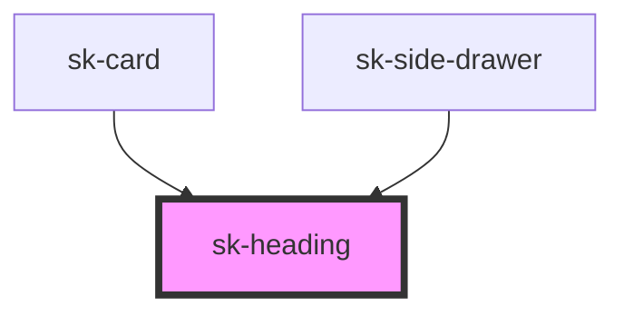

# sk-heading

<!-- Auto Generated Below -->

## Properties

| Property | Attribute | Description | Type                                | Default  |
| -------- | --------- | ----------- | ----------------------------------- | -------- |
| `align`  | `align`   |             | `"center" \| "left"`                | `'left'` |
| `size`   | `size`    |             | `"display" \| "lg" \| "md" \| "sm"` | `'md'`   |

## Dependencies

### Used by

 - [sk-card](../sk-card)
 - [sk-side-drawer](../side-drawer)

### Graph

----------------------------------------------

*Built with [StencilJS](https://stenciljs.com/)*
