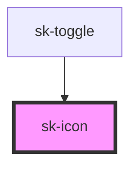

# sk-icon

<!-- Auto Generated Below -->

## Overview

sk-icon: Scalable SVG icon component

Icons inherit color from the text color (currentColor) and can be sized via the size prop.

## Properties

| Property    | Attribute    | Description                                                                         | Type                                                                                                                                               | Default     |
| ----------- | ------------ | ----------------------------------------------------------------------------------- | -------------------------------------------------------------------------------------------------------------------------------------------------- | ----------- |
| `ariaLabel` | `aria-label` | Optional aria-label for accessibility                                               | `string`                                                                                                                                           | `undefined` |
| `dir`       | `dir`        | Direction for chevron icon (down, up, left, right) Only used when name is 'chevron' | `"down" \| "left" \| "right" \| "up"`                                                                                                              | `'down'`    |
| `name`      | `name`       | The name of the icon to display                                                     | `"arrow" \| "check" \| "chevron" \| "close" \| "external" \| "github" \| "instagram" \| "mail" \| "menu" \| "moon" \| "plus" \| "search" \| "sun"` | `'arrow'`   |
| `size`      | `size`       | The size of the icon in pixels                                                      | `number`                                                                                                                                           | `16`        |

## Dependencies

### Used by

 - [sk-toggle](../sk-toggle)

### Graph

----------------------------------------------

*Built with [StencilJS](https://stenciljs.com/)*
