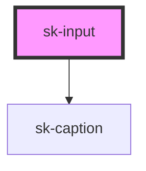

# sk-input

<!-- Auto Generated Below -->

## Properties

| Property          | Attribute     | Description | Type                                                                        | Default     |
| ----------------- | ------------- | ----------- | --------------------------------------------------------------------------- | ----------- |
| `accessibleLabel` | `aria-label`  |             | `string`                                                                    | `undefined` |
| `disabled`        | `disabled`    |             | `boolean`                                                                   | `false`     |
| `error`           | `error`       |             | `boolean \| string`                                                         | `false`     |
| `hint`            | `hint`        |             | `string`                                                                    | `''`        |
| `label`           | `label`       |             | `string`                                                                    | `''`        |
| `placeholder`     | `placeholder` |             | `string`                                                                    | `''`        |
| `type`            | `type`        |             | `"email" \| "number" \| "password" \| "search" \| "tel" \| "text" \| "url"` | `'text'`    |
| `value`           | `value`       |             | `string`                                                                    | `''`        |

## Events

| Event      | Description | Type                  |
| ---------- | ----------- | --------------------- |
| `skBlur`   |             | `CustomEvent<string>` |
| `skChange` |             | `CustomEvent<string>` |
| `skFocus`  |             | `CustomEvent<string>` |
| `skInput`  |             | `CustomEvent<string>` |

## Dependencies

### Depends on

- [sk-caption](../sk-caption)

### Graph

----------------------------------------------

*Built with [StencilJS](https://stenciljs.com/)*
