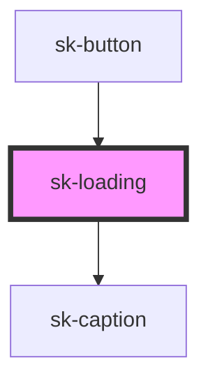

# sk-loading

<!-- Auto Generated Below -->

## Properties

| Property | Attribute | Description | Type                   | Default |
| -------- | --------- | ----------- | ---------------------- | ------- |
| `label`  | `label`   |             | `string`               | `''`    |
| `size`   | `size`    |             | `14 \| 20 \| 28 \| 40` | `40`    |

## Dependencies

### Used by

 - [sk-button](../sk-button)

### Depends on

- [sk-caption](../sk-caption)

### Graph

----------------------------------------------

*Built with [StencilJS](https://stenciljs.com/)*
