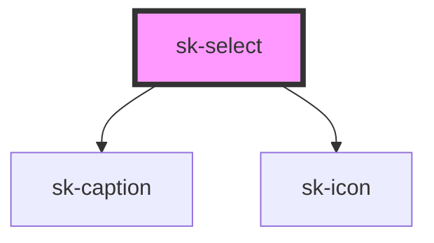

# sk-select

<!-- Auto Generated Below -->

## Properties

| Property          | Attribute     | Description | Type                 | Default       |
| ----------------- | ------------- | ----------- | -------------------- | ------------- |
| `accessibleLabel` | `aria-label`  |             | `string`             | `undefined`   |
| `disabled`        | `disabled`    |             | `boolean`            | `false`       |
| `label`           | `label`       |             | `string`             | `''`          |
| `options`         | `options`     |             | `string \| string[]` | `[]`          |
| `placeholder`     | `placeholder` |             | `string`             | `'Select...'` |
| `value`           | `value`       |             | `string`             | `null`        |

## Events

| Event      | Description | Type                  |
| ---------- | ----------- | --------------------- |
| `skChange` |             | `CustomEvent<string>` |

## Dependencies

### Depends on

- [sk-caption](../sk-caption)
- [sk-icon](../sk-icon)

### Graph

----------------------------------------------

*Built with [StencilJS](https://stenciljs.com/)*
