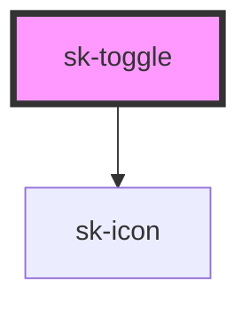

# sk-toggle

<!-- Auto Generated Below -->

## Properties

| Property    | Attribute    | Description | Type      | Default     |
| ----------- | ------------ | ----------- | --------- | ----------- |
| `ariaLabel` | `aria-label` |             | `string`  | `undefined` |
| `checked`   | `checked`    |             | `boolean` | `false`     |
| `disabled`  | `disabled`   |             | `boolean` | `false`     |
| `label`     | `label`      |             | `string`  | `undefined` |

## Events

| Event      | Description | Type                   |
| ---------- | ----------- | ---------------------- |
| `skChange` |             | `CustomEvent<boolean>` |

## Dependencies

### Depends on

- [sk-icon](../sk-icon)

### Graph

----------------------------------------------

*Built with [StencilJS](https://stenciljs.com/)*
