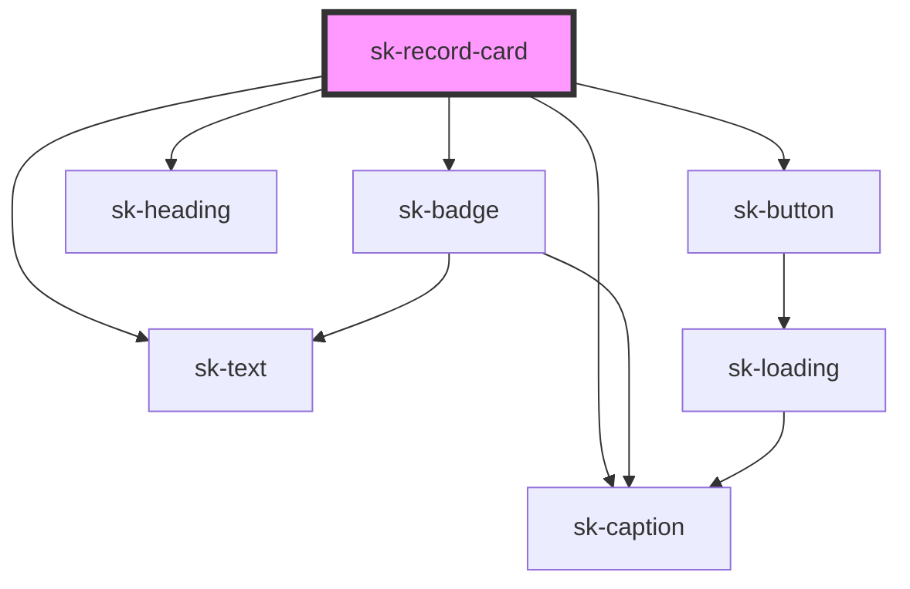

# sk-record-card

<!-- Auto Generated Below -->

## Properties

| Property          | Attribute    | Description | Type                                                                    | Default     |
| ----------------- | ------------ | ----------- | ----------------------------------------------------------------------- | ----------- |
| `accessibleLabel` | `aria-label` |             | `string`                                                                | `undefined` |
| `artist`          | `artist`     |             | `string`                                                                | `''`        |
| `condition`       | `condition`  |             | `"" \| "G" \| "GOOD" \| "NM" \| "RARE" \| "VERY GOOD" \| "VG" \| "VG+"` | `''`        |
| `genre`           | `genre`      |             | `string`                                                                | `''`        |
| `imageAlt`        | `image-alt`  |             | `string`                                                                | `''`        |
| `imageSrc`        | `image-src`  |             | `string`                                                                | `''`        |
| `inStock`         | `in-stock`   |             | `boolean`                                                               | `true`      |
| `label`           | `label`      |             | `string`                                                                | `''`        |
| `price`           | `price`      |             | `number`                                                                | `0`         |
| `recordTitle`     | `title`      |             | `string`                                                                | `''`        |
| `variant`         | `variant`    |             | `"detail" \| "grid" \| "list"`                                          | `'grid'`    |
| `year`            | `year`       |             | `string`                                                                | `''`        |

## Events

| Event              | Description | Type                                       |
| ------------------ | ----------- | ------------------------------------------ |
| `skAddToSelection` |             | `CustomEvent<KeyboardEvent \| MouseEvent>` |

## Dependencies

### Depends on

- [sk-badge](../../components/sk-badge)
- [sk-heading](../../components/sk-heading)
- [sk-text](../../components/sk-text)
- [sk-caption](../../components/sk-caption)
- [sk-button](../../components/sk-button)

### Graph

----------------------------------------------

*Built with [StencilJS](https://stenciljs.com/)*
